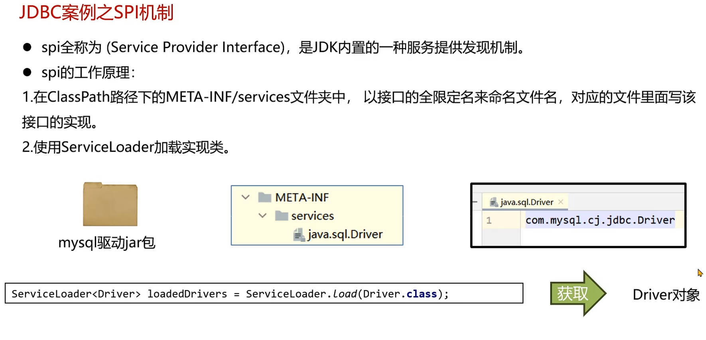
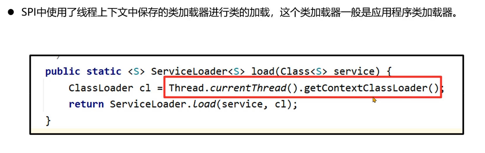
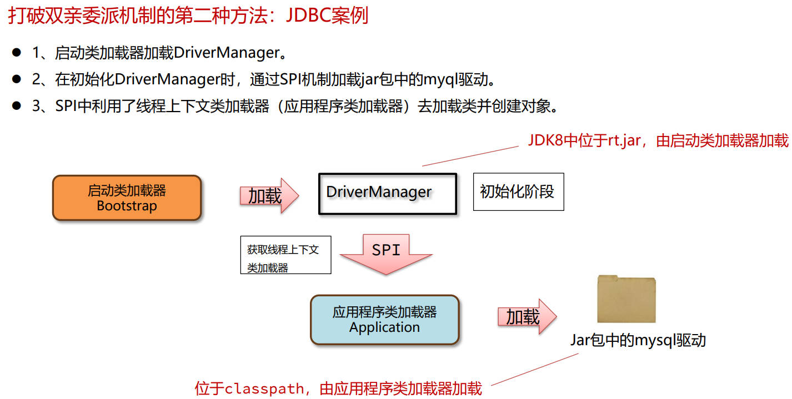

## java虚拟机的组成


### 字节码文件的组成（使用jclasslib解析class文件）

* 基础信息：魔数（java字节码文件头部，以CAFEBABE开头）、字节码文件对应的java版本号（JDK版本=主版本号-44）；访问标识(public final等)；父类和接口
* 常量池：保存了字符串常量、类和接口名、字段名；主要在字节码指令中使用
* 字段：当前类或接口声明的字段信息
* 方法：当前类或接口声明的方法信息；字节码指令
* 属性：类的属性，比如源码的文件名；内部类的列表等

##### 操作数栈（临时存放）


##### 局部变量表数组（局部变量存放位置）


##### 字节码工具

* 使用jclasslib解析class文件
* javap -v命令
* arthas的dump命令在线导出class文件，jad在线反编译


### 类的生命周期

* 加载：可以从本地文件、动态代理生成、网络传输加载到JVM中，并且在方法区(instanceKlass)和堆区中各创建一个互相关联的对象，主要关注堆区中的对象(Java.lang.Class)
* 连接： 验证(验证内容是否满足《Java虚拟机规范》)、准备(给静态变量赋初值)、解析(将常量池中的符号引用替换成指向内存的直接引用)
* 初始化：
  * 以下几种方式会导致类的初始化：
    * 访问一个类的静态变量或者静态方法；！注意变量是final修饰的并且等号右边是常量不触发初始化。
    * 调用Class.forName(String className)
    * new一个该类的对象时
    * 执行Main方法的当前类
  * clinit指令在特定情况下不会出现，如下：
    * 无静态代码块且无静态变量赋值语句
    * 有静态变量的声明，但是没有赋值语句
    * 静态变量的定义使用final关键字，这类变量会在准备阶段直接进行初始化
* 使用
* 卸载


##### 查看内存中的对象

使用JDK自带的hsdb工具查看Java虚拟机内存信息。工具位于JDK安装目录下lib文件夹的sa-jdi.jar中

java指定启动类运行命令： java -cp sa-jdi.jar sun.jvm.hotspot.HSDB


### 类加载器

##### 类加载器的作用

类加载器(ClassLoader)负责在类加载过程中的字节码获取并加载到内存这一部分。通过加载字节码数据放入内存转换成byte[]，接下来调用虚拟机底层方法将byte[]转换成方法区和堆中的数据。

##### 类加载器分类

* 启动类加载器(Bootstrap)：虚拟机底层实现；加载Java中最核心的类
  * 默认加载Java安装目录/jre/lib下的类文件，比如rt.jar,tools.jar,resources.jar等
  * 通过启动类加载器去加载用户jar包：
    * 放入/jre/lib下扩展（不推荐）：尽量不修改安装目录内容；文件名可能不匹配导致加载不成功
    * 使用参数进行扩展（推荐）：使用 -Xbootclasspath/a:jar包目录/jar包名 进行扩展

* 扩展类加载器(Extension)：JDK中提供的、使用java编写的类加载器；允许扩展Java中比较通用的类
  * 默认加载java安装目录/jre/lib/ext下的文件
  * 通过扩展类加载器去加载用户jar包：
    * 放入/jre/lib/ext下进行扩展（不推荐）：尽量不更改JDK安装目录中的内容
    * 使用参数进行扩展（推荐）：使用 -Djava.ext.dirs=jar包目录 进行扩展，这种方式会覆盖掉原始目录，可以使用;(windows)或:(macos/linux)拼接上原始目录

* 应用程序类加载器(Application)：加载应用使用的类
  * 加载classpath下的类文件

##### 查看类加载器

1. String.class.getClassLoader();

   String.class获取的是堆区上的对象，通过getClassLoader或者类加载器，java代码不能获取启动类加载器，会得到null结果

2. 使用Arthas中加载器功能 classloader 查看各种信息

   ```sh
   classloader #查看所有类加载器及加载的类数量等
   classloader -l #查看所有类加载器及其hash值
   classloader -c hash值 #查看该类加载器加载的所有类
   ```


### 双亲委派机制

* 双亲委派机制的作用
  1. 保证类加载的安全性：避免恶意代码替换JDK中的核心类库，确保核心类库的完整性和安全性
  2. 避免重复加载：双亲委派机制可以避免同一个类被多次加载

* 双亲委派机制
  1. **启动类加载器(Bootstrap)**  <--父类加载器--  **扩展类加载器(Extension)**  <--父类加载器--  **应用程序类加载器(Application)**
  2. 向上查找是否加载过：向上查找如果已经加载过，就直接返回Class对象，加载结束。避免同一个类被重复加载
  3. 向下尝试是否加载：如果所有的父类加载器都无法加载该类，则由当前类加载器自己尝试加载


### 打破双亲委派机制

* 自定义类加载器：重写loadClass方法可以将双亲委派机制的代码去除，Tomcat通过这方式实现不同应用之间的类隔离
  * 默认的父类加载器由getSystemClassLoader方法设置，该方法返回的是AppClassLoader
  * **两个自定义类加载器加载相同限定名的类不会冲突**，只有**相同类加载器+相同的类限定名**才会被认为是同一个类。在Arshas中使用 sc -d 类名 的方法查看具体的情况。
  * 正确的实现一个自定义类加载器的方法是重写**findClass**方法，这样不会破坏双亲委派机制
  
* 线程上下文类加载器：利用上下文类加载器加载类，比如JDBC和JNDI等
  
  * 使用 Thread.currentThread().getContextClassLoader();获取当前线程的类加载器
  
  
  
  
  
  
  
* OSGi架构的类加载器：OSGi模块化框架（了解即可）

##### JDK9之后的类加载器(JDK9引入了module的概念)

* 启动类加载器
  * 启动类加载器使用Java编写，位于 jkd.internal.loader.ClassLoader类中
  * Java中的BootClassLoader继承自BuiltinClassLoader实现从模块中找到要加载的字节码资源文件
  * **启动类加载器依然无法通过Java代码获取到，返回的仍然是null，保持了统一**

* 扩展类加载器替换成平台类加载器(Platform Class Loader)
  * 平台类加载器遵循模块化方式加载字节码文件，所以继承关系从URLClassLoader变成了BuiltinClassLoader，BuiltinClassLoader实现了从模块中加载字节码文件
  * **平台类加载器的存在更多的是为了与老版本的设计方案兼容，自身没有特殊的逻辑**
