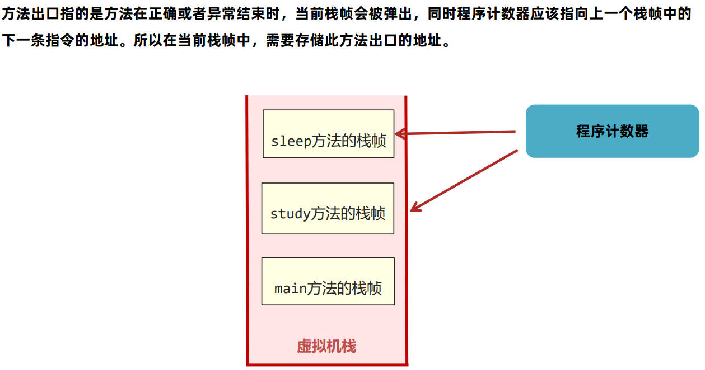
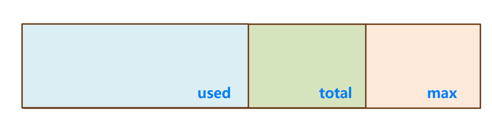
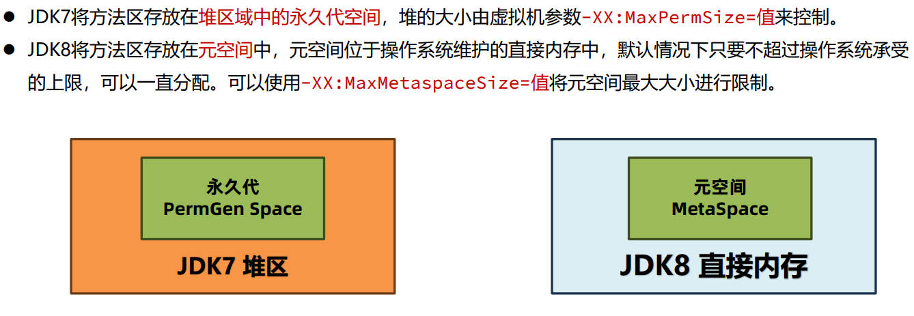

## java虚拟机的组成


### 运行时数据区

* Java虚拟机在运行Java程序过程中管理的内存区域，称之为**运行时数据区**

* 《Java虚拟机规范》中规定了每一部分的作用
  * 线程不共享
    * **<u>程序计数器</u>**：也叫PC寄存器，每个线程都会通过程序计数器记录当前要执行的字节码指令的地址。
    
      在加载阶段，虚拟机将字节码文件的指令读取到内存之后，会将原文件中的偏移量转换成内存地址。每一条字节码指令都会拥有一个内存地址。
    
      程序计数器可以控制程序指令的进行，实现分支、跳转、异常等逻辑。
    
      在多线程执行情况下，Java虚拟机需要通过程序计数器记录CPU切换前解释执行到哪一句指令并继续解释运行。
    
      ***程序计数器不会发生内存溢出；程序员无需堆程序计数器做任何处理***
    * **<u>Java虚拟机栈</u>**：采用栈的数据结构来管理方法调用中的基础数据，先进后出，每一个方法的调用使用一个栈帧来保存。
    
      ***栈帧的组成***：
    
      <u>*局部变量表*</u>：方法执行过程中存放所有的局部变量；保存的内容有：实例方法的this对象、方法的参数、方法体重声明的局部变量；为了节省空间，局部变量表中的槽是可以复用的，一旦某个局部变量不再生效（如代码块内变量），当前槽可以再次被使用。
    
      <u>*操作数栈*</u>：操作数栈是栈帧中虚拟机在执行指令过程中用来存放中间数据的一块区域，他是一种栈式的数据结构，如果一条指令将一个值压入操作数栈，则后面的指令可以弹出并使用该值。在**编译期**就可以确定操作数栈的最大深度，从而在执行时正确的分配内存大小。
    
      <u>*帧数据*</u>：主要包含<u>动态链接</u>(保存了字节码编号到运行时常量池的内存地址映射关系，引用其他类的属性或方法时使用)、<u>方法出口</u>(保存上个栈帧中的下一条指令的地址，在该方法结束时可以继续执行)、<u>异常表的引用</u>(代码中异常的处理信息，包含try代码块和catch代码块执行后跳转到字节码的指令位置)
    
      
    
      Java虚拟机栈如果栈帧过多，占用内存超过栈内存可以分配的最大大小就会出现**内存溢出**(StackOverflowError)；如果不指定栈大小，JVM将创建一个**默认大小的栈**，大小取决于操作系统。**可使用虚拟机参数 -Xss 修改Java虚拟机栈的大小**。 局部变量过多、操作数栈深度过大也会影响栈内存的大小。**大部分情况下可设置为 -Xss256k 节省内存**。
    * **<u>本地方法栈</u>**：存储的是native本地方法的栈帧。在Hotspot虚拟机中，Java虚拟机栈和本地方法栈实现上使用了同一个栈空间。
    
  * 线程共享
  
    * **<u>堆</u>**：一般Java程序中堆内存是空间最大的一块内存区域，创建出来的对象都存在于堆上。栈上的局部变量表中，可以存放堆上对象的引用；静态变量也可以存放堆对象的引用，通过静态变量可以实现对象在线程直接共享。
  
      当对象一直向堆中放入对象达到上限之后，就会抛出OutOfMemoryError错误。
  
      
  
      堆空间有三个需要关注的值，used(当前已使用的堆内存)、total(Java虚拟机已经分配的可用堆内存)、max(Java虚拟机可以分配的最大堆内存)。如果不设置任何的虚拟机参数，max默认是系统内存的1/4，total默认是系统内存的1/64。**实际应用中一般都需要设置total和max的值**。**要修改堆的大小，可以使用虚拟机参数 -Xmx(max最大值) 和 -Xms(初始的total)**。Xmx必须大于2MB, Xms必须大于1MB。Java服务端程序开发时，**建议将 -Xmx和 -Xms设置为相同的值**，这样在程序启动之后可使用的总内存就是最大内存，减少了申请并分配内存时间上的开销，同时不会出现内存过剩之后堆收缩的情况。
  
    * **<u>方法区</u>**：
  
      
  
      * 类的元信息：保存了所有类的基本信息，在类的**加载阶段**完成
      
      * 运行时常量池：保存了字节码文件中的常量池内容
      
      * 字符串常量池：保存了字符串常量
      
        ```java
        // 使用a+b会通过StringBuild拼接，地址存放在堆中，返回堆中地址；直接相加会在字符串常量池相加，返回常量池中的地址
        String a = "1";
        String b = "2";
        String c = "12";
        String d = a+b;
        String e = "1" + "2";
        System.out.println(c == d); // false
        System.out.println(c == e); // true
        ```


##### 直接内存

并不存在《Java虚拟机规范》中，所以不属于Java运行时的内存区域。在JDK1.4中引入了NIO机制，使用了直接内存，主要解决以下两个问题：

1. Java堆中的对象如果不再使用要回收，回收时会影响对象的创建和使用。
2. IO操作比如读文件，需要先把文件读取到直接内存(缓冲区)再把数据复制到Java堆中。现在直接放入直接内存即可，同时Java堆上维护直接内存的引用，减少了数据复制的开销。

**默认不设置该参数情况下，JVM会自动选择 最大分配的大小。如果需要手动调整直接内存的大小，可以使用 -XX:MaxDiretMemorySize=大小**