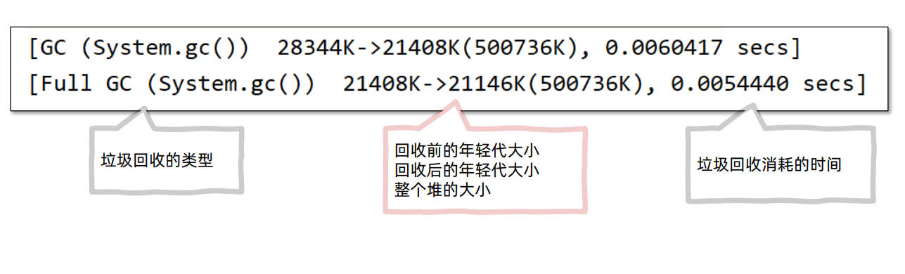
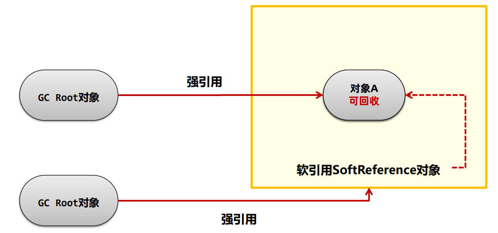

## JVM垃圾回收

Java中为了简化对象的释放，引入了自动的**垃圾回收（Garbage Collection简称GC）**机制。通过垃 圾回收器来对不再使用的对象完成自动的回收，垃圾回收器主要负责对**堆**上的内存进行回收。其他 很多现代语言比如C#、Python、Go都拥有自己的垃圾回收器。

### 自动垃圾回收

##### 应用场景

1. 解决系统僵死的问题：频繁的垃圾回收可能导致系统僵死
2. 性能优化：对垃圾回收器进行合理的设置可以有效地提升程序的执行性能

**线程不共享的部分，都是伴随着线程的创建而创建，线程的销毁而销毁**。而方法的栈帧在执行完方法之后就会自动弹出栈并释放掉对应的内存。

### 方法区回收

* 方法区中能回收的内容主要就是不再使用的类。

  判定一个类可以被卸载。需要同时满足下面三个条件： 

  1. **此类所有实例对象都已经被回收，在堆中不存在任何该类的实例对象以及子类对象。**
  2. **加载该类的类加载器已经被回收。**
  3. **该类对应的 java.lang.Class 对象没有在任何地方被引用。**

* 手动触发回收

  **如果需要手动触发垃圾回收，可以调用System.gc()方法**。调用System.gc()方法并不一定会立即回收垃圾，仅仅是向Java虚拟机发送一个垃圾回收的请求，具体是否需要执行垃圾回收Java虚拟机会自行判断。
* 方法区回收场景

  开发中此类场景一般很少出现，主要在如 OSGi、JSP 的热部署等应用场景中。 每个jsp文件对应一个唯一的类加载器，当一个jsp文件修改了，就直接卸载这个jsp类 加载器。重新创建类加载器，重新加载jsp文件。

### 堆回收

**判断堆上的对象是否可回收** 

<u>Java中的对象是否能被回收，是根据对象是否被引用来决定的。如果对象被引用了，说明该对象还 在使用，不允许被回收。</u>

**判断堆上的对象没有被引用**

常见的有两种判断方法：**引用计数法**和**可达性分析法**

* 引用计数器
  * 引用计数法会为每个对象维护一个引用计数器，当对象被引用时加1，取消引用时减1。
  * 引用计数法的优点是实现简单，C++中的智能指针就采用了引用计数法，但是它也存在缺点，主要有两点： 
    * 每次引用和取消引用都需要维护计数器，对系统性能会有一定的影响 
    * 存在循环引用问题，所谓循环引用就是当A引用B，B同时引用A时会出现对象无法回收的问题。
* 可达性分析法
  * Java使用的是**可达性分析算法**来判断对象是否可以被回收。可达性分析将对象分为两类：垃圾回收的根对象（GC Root）和普通对象，对象与对象之间存在引用关系。以下属于GC Root对象：
    * 线程Thread对象。 
    * 系统类加载器加载的java.lang.Class对象。
    * 监视器对象，用来保存同步锁synchronized关键字持有的对象。
    * 本地方法调用时使用的全局对象。
  * 查看GC Root：通过arthas和eclipse Memory Analyzer (MAT) 工具可以查看GC Root
    * 使用arthas的heapdump命令将堆内存快照保存到本地磁盘中。
    * 使用MAT工具打开堆内存快照文件。
    * 选择GC Roots功能查看所有的GC Root。

**查看垃圾回收日志 使用JVM参数 -verbose:gc**

### 对象引用

可达性算法中描述的对象引用，一般指的是强引用，即是GCRoot对象对普通对象有引用关系，只要这层关系存在， 普通对象就不会被回收。除了**强引用**之外，Java中还设计了几种其他引用方式：

* 软引用

  软引用相对于强引用是一种比较弱的引用关系，如果一个对象只有软引用关联到它，当程序内存不足时，就会将软 引用中的数据进行回收。

  

  软引用的执行过程：

  	1. 将对象使用软引用包装起来，new SoftReference<对象类型>(对象)。 
  	1. 内存不足时，虚拟机尝试进行垃圾回收。 
  	1. 如果垃圾回收仍不能解决内存不足的问题，回收软引用中的对象。 
  	1. 如果依然内存不足，抛出OutOfMemory异常。

  SoftReference提供了一套队列机制：

  	1. 软引用创建时，通过构造器传入引用队列。
  	1. 在软引用中包含的对象被回收时，该软引用对象会被放入引用队列。
  	1. 通过代码遍历引用队列，将SoftReference的强引用删除。

* 弱引用

  弱引用的整体机制和软引用基本一致，区别在于弱引用包含的对象在垃圾回收时，不管内存够不够都会直接被回收。

  在JDK 1.2版之后提供了WeakReference类来实现弱引用，弱引用主要在ThreadLocal中使用。

  弱引用对象本身也可以使用引用队列进行回收。

  

* 虚引用

  虚引用也叫幽灵引用/幻影引用，不能通过虚引用对象获取到包含的对象。虚引用唯一的用途是当对象被垃圾回 收器回收时可以接收到对应的通知。

  Java中使用PhantomReference实现了虚引用，直接内存中为了及时知道 直接内存对象不再使用，从而回收内存，使用了虚引用来实现。

* 终结器引用

  终结器引用指的是在对象需要被回收时，终结器引用会关联对象并放置在Finalizer类中的引用队列中，在稍后 由一条由FinalizerThread线程从队列中获取对象，然后执行对象的finalize方法，在对象第二次被回收时，该 对象才真正的被回收。在这个过程中可以在finalize方法中再将自身对象使用强引用关联上，但是不建议这样做。

**虚引用和终结器引用用在常规开发中是不会使用的。**
