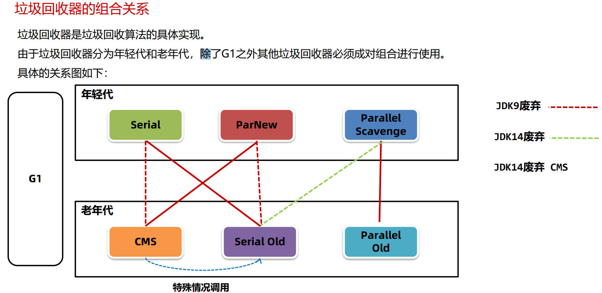
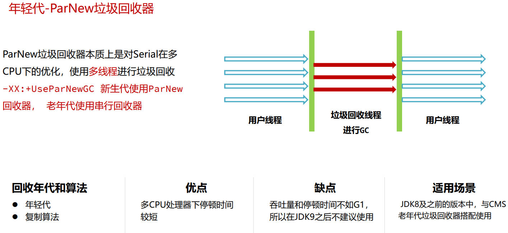
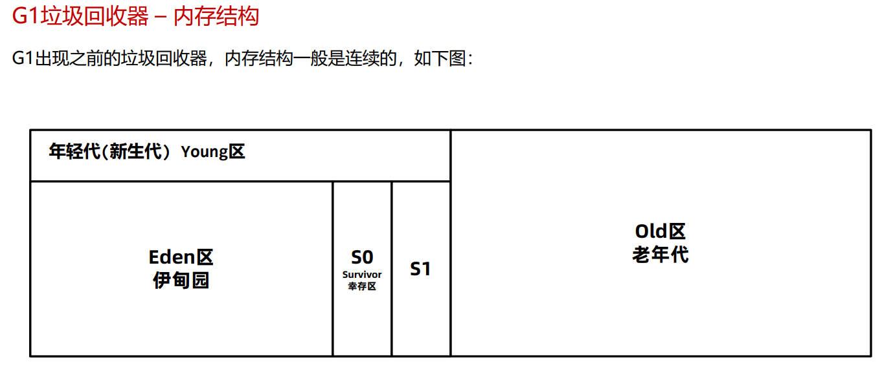

## 垃圾回收算法

**垃圾回收主要做的两件事：**

1. 找到内存中存活的对象
2. 释放不再存活对象的内存，使得程序能再次利用这部分空间

**垃圾回收算法的评价标准：**

Java垃圾回收过程会通过单独的GC线程来完成，但是不管使用哪一种GC算法，都会有部分阶段需要停止所 有的用户线程。这个过程被称之为Stop The World简称STW，如果STW时间过长则会影响用户的使用。

判断GC算法是否优秀的三个方面：

1. 吞吐量：指的是 CPU 用于执行用户代码的时间与 CPU 总执行时间的比值，即吞吐量 = 执行用户代码时间 / （执行用户代码时间 + GC时间）。吞吐量数值越高，垃圾回收的效率就越高。

2. 最大暂停时间：最大暂停时间指的是所有在垃圾回收过程中的STW时间最大值。最大暂停时间越短，用户使用系统时 受到的影响就越短。

3. 堆使用效率：不同垃圾回收算法，对堆内存的使用方式是不同的。比如标记清除算法，可以使用完整的堆内存。而复制算 法会将堆内存一分为二，每次只能使用一半内存。从堆使用效率上来说，标记清除算法要优于复制算法。

   

上述三种评价标准：堆使用效率、吞吐量，以及最大暂停时间不可兼得。 

一般来说，堆内存越大，最大暂停时间就越长。想要减少最大暂停时间，就会降低吞吐量。 

**不同的垃圾回收算法，适用于不同的场景。**

### 垃圾回收算法的分类

* 标记-清除算法
* 复制算法
* 标记-整理算法
* 分代GC

##### 标记-清除算法

标记清除算法的核心思想分为两个阶段： 

1. 标记阶段，将所有存活的对象进行标记。Java中使用可达性分析算法，从GC Root开始通过引用链遍历出 所有存活对象。
2.  清除阶段，从内存中删除没有被标记也就是非存活对象。

优点：实现简单，只需要在第一阶段给每个对象维护标志位，第二阶段删除对象即可。

缺点：

1. 碎片化问题 由于内存是连续的，所以在对象被删除之后，内存中会出现很多细小的可用内存单元。如果我们需要的是一 个比较大的空间，很有可能这些内存单元的大小过小无法进行分配。
2. 分配速度慢。由于内存碎片的存在，需要维护一个空闲链表，极有可能发生每次需要遍历到链表的最后才 能获得合适的内存空间。

##### 复制算法

复制算法的核心思想是： 

1. 准备两块空间From空间和To空间，每次在对象分配阶段，只能使用其中一块空间（From空间）。 
2. 在垃圾回收GC阶段，将From中存活对象复制到To空间。 
3. 将两块空间的From和To名字互换。

完整的复制算法的例子： 

1. 将堆内存分割成两块From空间 To空间，对象分配阶段，创建对象。 
2. GC阶段开始，将GC Root搬运到To空间 
3. 将GC Root关联的对象，搬运到To空间 
4. 清理From空间，并把名称互换

优点：

1. 吞吐量高：复制算法只需要遍历一次存活对象 复制到To空间即可，比标记-整理 算法少了一次遍历的过程，因而性 能较好，但是不如标记-清除算法， 因为标记清除算法不需要进行对象 的移动
2. 不会发生碎片化：复制算法在复制之后就会将对象按顺序放 入To空间中，所以对象以外的区域都是可 用空间，不存在碎片化内存空间。

缺点：内存使用效率低(每次只能让一半的内存空间来为创 建对象使用)

##### 标记-整理算法

标记整理算法也叫标记压缩算法，是对标记清理算法中容易产生内存碎片问题的一种解决方案。 

核心思想分为两个阶段： 

1. 标记阶段，将所有存活的对象进行标记。Java中使用可达性分析算法，从GC Root开始通过引用链遍历出 所有存活对象。 
2. 整理阶段，将存活对象移动到堆的一端。清理掉存活对象的内存空间。

优点：

1. 内存使用效率高：整个堆内存都可以使用，不会像复 制算法只能使用半个堆内存
2. 不会发生碎片化：在整理阶段可以将对象往内存的一侧进行 移动，剩下的空间都是可以分配对象的有 效空间

缺点：整理阶段的效率不高

##### 分代GC算法

**arthas查看分代之后的内存情况**

* 在JDK8中，添加-XX:+UseSerialGC参数使用分代回收的垃圾回收器，运行程序。
* 在arthas中使用memory命令查看内存，显示出三个区域的内存情况。

**调整内存区域的大小**

根据以下虚拟机参数，调整堆的大小并观察结果。注意加上**-XX:+UseSerialGC**

**分代GC算法的过程：**

分代回收时，创建出来的对象，首先会被放入Eden伊甸园区。 

随着对象在Eden区越来越多，如果Eden区满，新创建的对象已经无法放入，就会触发年轻代的GC，称为 Minor GC或者Young GC。 

Minor GC会把需要eden中和From需要回收的对象回收，把没有回收的对象放入To区。

接下来，S0会变成To区，S1变成From区。当eden区满时再往里放入对象，依然会发生Minor GC。 

此时会回收eden区和S1(from)中的对象，并把eden和from区中剩余的对象放入S0。 

注意：每次Minor GC中都会为对象记录他的年龄，初始值为0，每次GC完加1。

如果Minor GC后对象的年龄达到阈值（最大15，默认值和垃圾回收器有关），对象就会被晋升至老年代。 

当老年代中空间不足，无法放入新的对象时，先尝试minor gc如果还是不足，就会触发Full GC，Full GC会对整个堆进行垃圾回收。 

如果Full GC依然无法回收掉老年代的对象，那么当对象继续放入老年代时，就会抛出Out Of Memory异常。

### 垃圾回收器

分代GC算法将堆分成年轻代和老年代主要原因有：

1. 可以通过调整年轻代和老年代的比例来适应不同类型的应用程序，提高内存的利用率和性能。
2. 新生代和老年代使用不同的垃圾回收算法，新生代一般选择复制算法，老年代可以选择标记-清除和标记-整理 算法，由程序员来选择灵活度较高。
3. 分代的设计中允许只回收新生代（minor gc），如果能满足对象分配的要求就不需要对整个堆进行回收(full gc),STW时间就会减少。

**垃圾回收器的组合关系**

##### Serial垃圾回收器

##### ParNew垃圾回收器

CMS执行步骤：

1. 初始标记，用极短的时间标记出GC Roots能直接关联到的对象。 
2. 并发标记, 标记所有的对象，用户线程不需要暂停。
3. 重新标记，由于并发标记阶段有些对象会发生了变化，存在错标、漏标等情况，需要重新标记。
4. 并发清理，清理死亡的对象，用户线程不需要暂停。

CMS缺点：

1. CMS使用了标记-清除算法，在垃圾收集结束之后会出现大量的内存碎片，CMS会在Full GC时进行碎片的整理。 这样会导致用户线程暂停，可以使用-XX:CMSFullGCsBeforeCompaction=N 参数（默认0）调整N次Full GC之 后再整理。
2. 无法处理在并发清理过程中产生的“浮动垃圾”，不能做到完全的垃圾回收。
3. 如果老年代内存不足无法分配对象，CMS就会退化成Serial Old单线程回收老年代。

CMS垃圾回收器线程资源争抢问题

* 在CMS中并发阶段运行时的线程数可以通过-XX:ConcGCThreads参数设置，默认值为0，由系统计算得出。

* 计算公式为(-XX:ParallelGCThreads定义的线程数 + 3) / 4， ParallelGCThreads是STW停顿之后的 并行线程数

* ParallelGCThreads是由处理器核数决定的： 

  * 当cpu核数小于8时，ParallelGCThreads = CPU核数 
  * 否则 ParallelGCThreads = 8 + (CPU核数 – 8 )*5/8

  

  

* 由于CPU的核心数有限，就会影响用户线程执行的性能。

##### Parallel Scavenge垃圾回收器

### G1垃圾回收器

##### 总结

垃圾回收器比较好的组合选择如下： 

**JDK8及之前：** 

* **ParNew + CMS（关注暂停时间）**
* **Parallel Scavenge + Parallel Old (关注 吞吐量)**
* **G1（JDK8之前不建议，较大堆并且关注暂停时间）** 

**JDK9之后: G1（默认）** 

从JDK9之后，由于G1日趋成熟，JDK默认的垃圾回收器已经修改为G1，所以 强烈建议在生产环境上使用G1。
